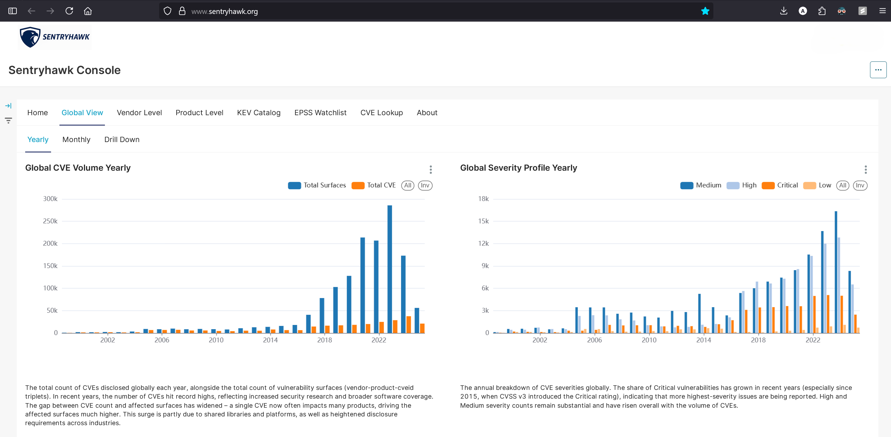
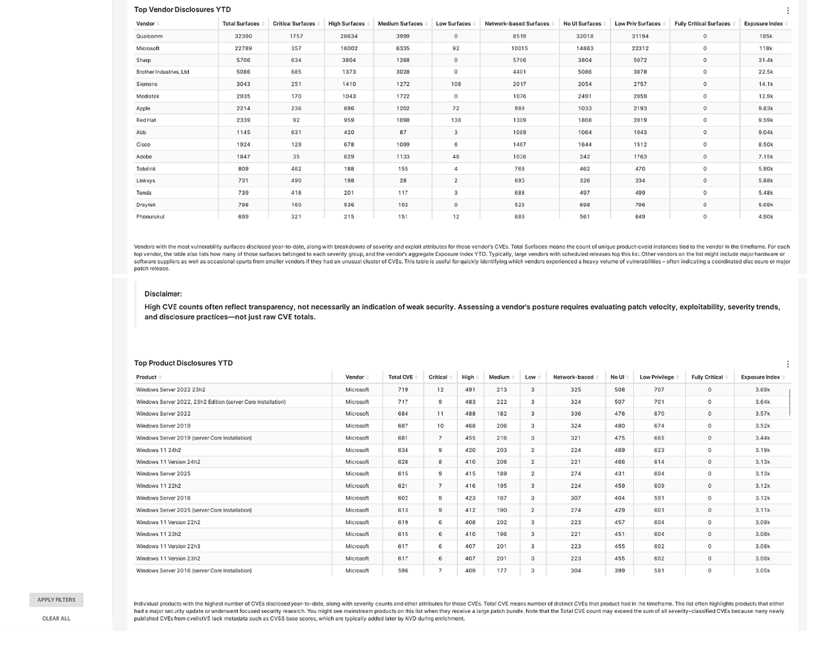
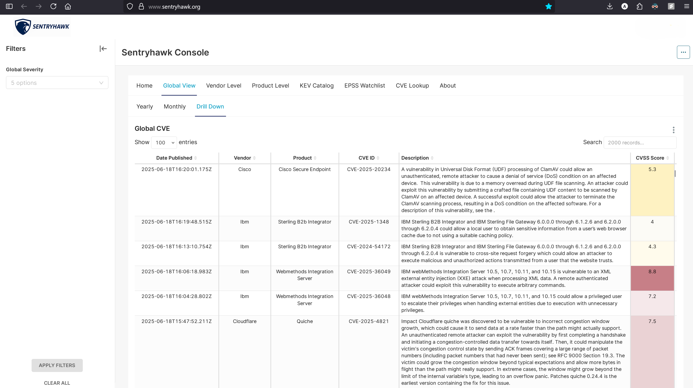
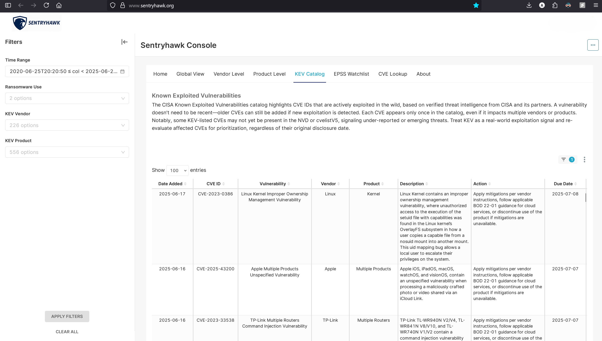
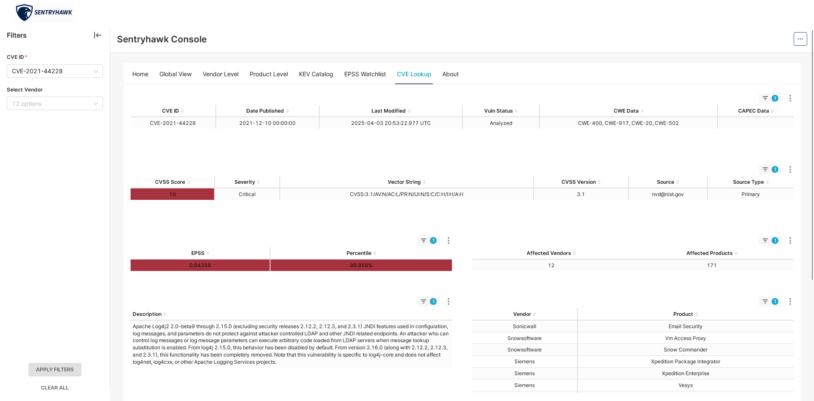
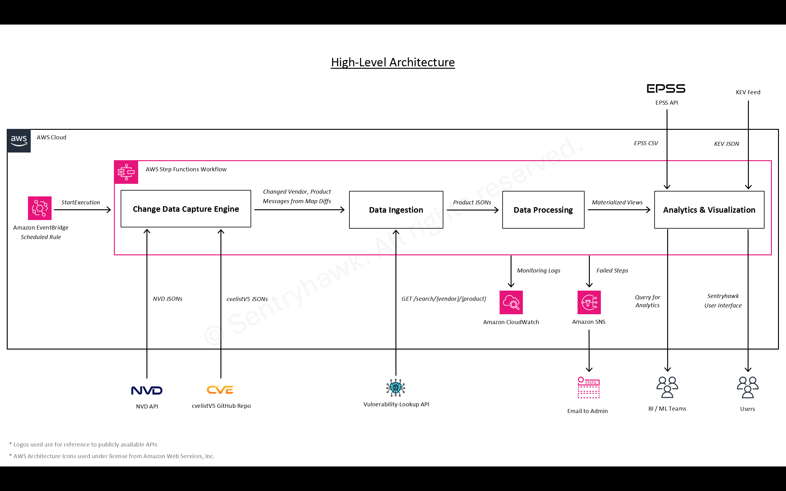
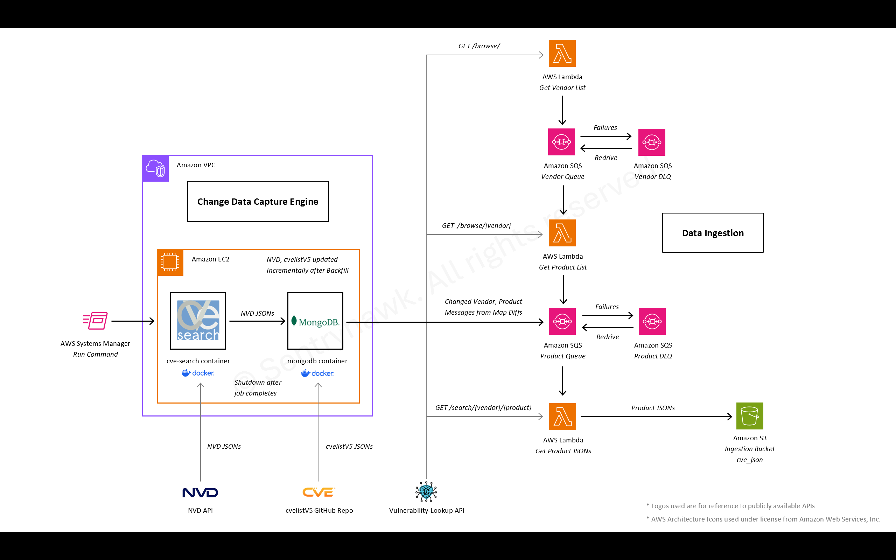
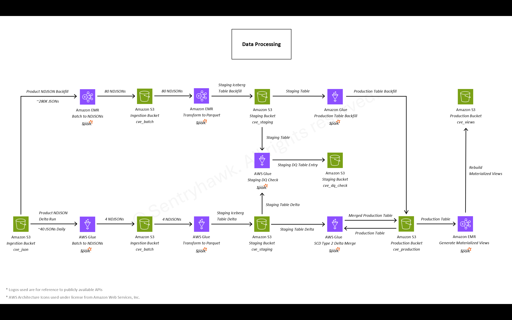
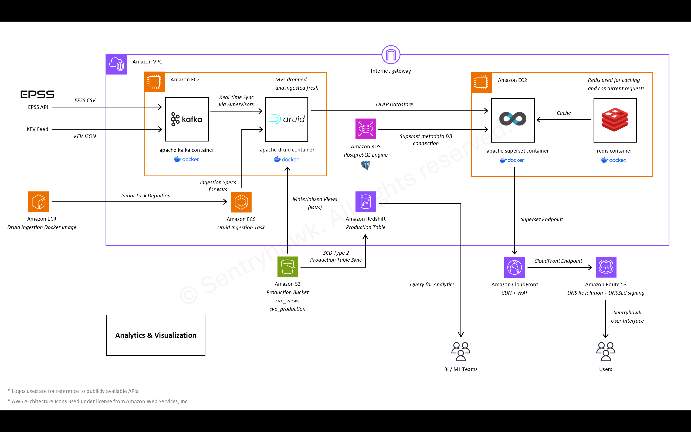

# Sentryhawk - Security Data Platform

 

Sentryhawk is a cloud-native cybersecurity platform that aggregates and enriches public vulnerability data from multiple feeds including NVD, cvelistV5, KEV and EPSS. The platform computes a cumulative Exposure Index — an aggregated CVSS-based score that highlights clustering software flaws. By transforming scattered threat data into structured, continuously updated insights, it helps security teams proactively prioritize patching and mitigation before adversaries can exploit vulnerabilities. Past breaches similar to Log4Shell and WannaCry often stem from known but unpatched vulnerabilities and this platform gives organizations the clarity to anticipate the next major breach. It surfaces actionable intelligence on global, vendor and product-specific risk trends, empowering defenders to make informed decisions in a rapidly evolving threat landscape.

## Table of Contents

- [Features](#features)
- [Data Pipeline Architecture](#data-pipeline-architecture)
- [Setup & Deployment](#setup--deployment)
- [Infrastructure & Data Stack](#infrastructure--data-stack)
- [License](#license)

## Features

- **Interactive Dashboards**: Out-of-the-box Superset dashboards show global vulnerability trends, vendor-specific risk rankings and product-level details. Users can filter by year or vendor and see visualizations of new CVEs and exposure scores. Dashboards are publicly sharable and support alerts/reports. The BI stack is fully open-source, providing sub-second query latency on aggregated views.  

  

- **Exposure Index**: A composite score aggregating CVSS severity across all known CVEs for a vendor/product. The Exposure Index highlights which vendors or products have an unusually high concentration of vulnerabilities. Teams can use it to prioritize patching or inventory audits where the index is high.  

  

- **Normalization & Deduplication**: The data pipeline automatically cleans and merges overlapping feeds. Inconsistent vendor/product naming conventions are harmonized so that the same entity isn't counted twice. This avoids false inflation of vulnerability counts and ensures the Exposure Index is meaningful.  

  

- **Real-time KEV & EPSS Streaming Pipeline**: The platform includes a real-time streaming pipeline for immediate ingestion of enrichment feeds. Apache Kafka ingests CISA's Known Exploited Vulnerabilities and EPSS exploit prediction scores through dedicated producers that monitor feed changes. KEV uses incremental updates with hash-based deduplication, while EPSS follows a full-replace strategy. Both streams are ingested into Apache Druid via Kafka supervisors, enabling real-time dashboard updates in Superset. This setup ensures immediate alerts for newly exploited vulnerabilities and updated exploit probability scores within minutes of publication.  

  

- **Open Source Stack**: All components are based on OSS (Python, MongoDB, Druid, Redis, Superset, etc.), with infrastructure defined in code. The result is a cost-effective, extensible system that any organization can audit and extend. All services run in Docker containers, enabling easy upgrades and community contributions.  

  

## Data Pipeline Architecture

The deployed pipeline is fully managed in AWS and consists of these stages:

1. **Trigger & Orchestration (EventBridge + Step Functions)**: An Amazon EventBridge scheduled rule (cron) triggers the data pipeline at fixed intervals. This invokes an AWS Step Functions state machine, which orchestrates all downstream processing. Step Functions handles sequencing, retry logic and error handling for the entire workflow.  

    

2. **Change Data Capture Engine (CDC)**: At the start of each run, the pipeline uses AWS Systems Manager to start an EC2 backend server. This instance runs Docker containers for MongoDB and a CVE-search service. A script on the instance fetches the latest CVE data from the NVD API and the cvelistV5 GitHub repository. A MongoDB map-diff process then determines which vendor–product combinations have new, removed, or changed CVEs. These differences are sent as messages to an Amazon SQS Product Queue. If any tasks fail to process, they go to a dead-letter queue. Unprocessed items in the DLQ are logged and an SNS alert is sent to administrator.  

3. **Data Ingestion (SQS + Lambda)**: Messages in the SQS queue drive the ingestion of product JSON data. AWS Lambda functions take each vendor–product message and call the external Vulnerability Lookup API to retrieve detailed CVE JSON data for that vendor/product. The raw JSON results are stored in an S3 ingestion bucket.  

    

4. **ETL and Data Quality (AWS Glue)**: The raw JSON files are then processed by a sequence of AWS Glue jobs. The jobs run in order:  
    
    - **Merge JSONs**: Combine the raw files into NDJSONs.
    - **Staging Load**: Process the merged data and ingest it into a staging Iceberg table in S3.
    - **Data Quality Check**: Validate data (e.g. schema, null checks) on the staging table.
    - **Production Load**: Merge staging into the production Iceberg table using Slowly Changing Dimension Type 2 logic, so that historical CVE records are preserved.
    
    If any Glue job fails, the pipeline pauses and an SNS notification is sent to the admin.  

5. **Materialized Views (Amazon EMR)**: After the production data is updated, the Step Function launches an Amazon EMR Spark cluster. This cluster computes pre-aggregated materialized views (for example, aggregations of CVSS scores by vendor/product, exposure indices, etc.) using Spark. The resulting views in parquet are written to S3. The EMR cluster then terminates automatically to minimize cost.  

    

6. **Parallel Analytics Refresh (Redshift & Druid)**: The pipeline executes simultaneous ingestion to both analytical engines:  

    - **Redshift Branch**: Executes stored procedures for incremental upserts with SCD Type 2 logic, maintaining `cve_current` table in Redshift with full history tracking and watermark-based incremental processing.
    - **Druid Branch**: Step Function scales up the Druid EC2 instance, executes a containerized ECS task to load materialized views from S3 and then scales the instance back down for cost optimization.
    
    This dual approach provides complementary strengths: Redshift supports complex historical analysis, SCD tracking and enterprise-grade SQL operations, while Druid enables sub-second queries for interactive Superset dashboards.  

    

Throughout the pipeline, Amazon SNS and CloudWatch provide monitoring and alerting. Any step failure triggers an SNS alert so administrators can investigate, ensuring reliability and transparency.

## Setup & Deployment

The Sentryhawk repository includes all configuration and code needed for deployment. In summary, a typical setup involves:

1. **Launch an EC2 Host**: Start an EC2 instance (e.g. Amazon Linux 2, c5.xlarge or larger) and install Docker & Docker Compose:  

    ```
    sudo yum update -y
    sudo yum install git -y
    sudo amazon-linux-extras install docker -y
    sudo systemctl start docker && sudo systemctl enable docker
    sudo usermod -aG docker ec2-user
    # Install Docker Compose (v2 plugin)
    mkdir -p ~/.docker/cli-plugins
    curl -SL https://github.com/docker/compose/releases/latest/download/docker-compose-linux-x86_64 \
      -o ~/.docker/cli-plugins/docker-compose
    chmod +x ~/.docker/cli-plugins/docker-compose
    ```

    Also obtain an NVD API key from https://nvd.nist.gov/developers/request-an-api-key for the CIRCL CVE search component.  

2. **Configure Environment**: Clone the CVE-Search pipeline repo:  

    ```
    git clone https://github.com/cve-search/CVE-Search-Docker.git
    cd CVE-Search-Docker
    ```

    Copy the provided configuration files into the root directory: `docker-compose.yml`, `.config.yml`, `Dockerfile.api`, `cve_backfill.sh`, `cve_mongo_map_backup.sh`, `cve_sqs_log.py`, etc. Populate your environment (e.g. in a `.env` file or via export) with the required secrets and endpoints. For example, set your NVD API key and other variables:  

    ```
    NVD_NIST_API_KEY="<YOUR_NVD_KEY>"
    MONGO_URI="mongodb://mongo:27017/"
    DB_NAME="cvedb"
    CVELIST_COLL="cvelistv5"
    NVD_COLL="cves"
    MAP_NVD_COLL="map_vendor_product_nvd"
    MAP_CVELIST_COLL="map_vendor_product_cvelistv5"
    DELTA_QUEUE_URL="https://sqs.<REGION>.amazonaws.com/<ACCOUNT_ID>/<QUEUE_NAME>"
    ```

3. **Build & Launch CVE Services**: Run the Docker Compose services:  

    ```
    docker compose build --no-cache
    docker compose up -d mongo redis cve_search
    ```

    Wait a few minutes for MongoDB and Redis to start. Then execute the initial backfill to load all historical vulnerability feeds:  

    ```
    chmod +x cve_backfill.sh
    nohup ./cve_backfill.sh > cve_backfill.log 2>&1 &
    tail -f cve_backfill.log
    ```

    This populates MongoDB with NVD, cvelistV5 and other CVE sources and builds the vendor–product mapping collections. Once finished, start the lookup API container:  

    ```
    docker compose up -d vendor_product_api
    ```

    You can verify the API is running by querying `http://<EC2-IP>:8000/api/search/{vendor}/{product}`  

4. **Setup ETL Workflow on AWS**: In the AWS console or via IaC, create: an S3 bucket for ingestion data, an SQS queue with DLQ for changed keys and an AWS Step Functions state machine using the provided JSON definition `step_functions/sentryhawk_state_machine.json`. Attach an IAM role granting access to S3, SQS, Glue, EMR, etc. Configure an EventBridge Scheduled rule to trigger the Step Function daily. The Step Function uses AWS Systems Manager `Run Command` to launch the Docker-based services (MongoDB + CVE-Search) and run the CDC job each cycle.  

5. **Data Transformation**: The workflow will launch the AWS Glue jobs (also provided in `glue/` scripts) to transform the NDJSON data into Parquet, run DQ checks and apply SCD Type 2 merges. After that, it fires up an EMR Spark cluster (using the `emr/` scripts) to generate the final materialized view tables. Verify that the Glue and EMR steps complete successfully. SNS alerts will notify you on failure for any step.  

6. **Deploy Analytics Stack**: Build the Druid ingestion image from the druid/ directory:  

    ```
    docker build -t cve-ingestion-druid:latest druid/cve-ingestion-druid
    ```

    Tag and push this image to your ECR repository (sentryhawk_repo):  

    ```
    aws ecr get-login-password --region <REGION> | docker login --username AWS --password-stdin <ACCOUNT_ID>.dkr.ecr.<REGION>.amazonaws.com
    docker tag cve-ingestion-druid:latest <ACCOUNT_ID>.dkr.ecr.<REGION>.amazonaws.com/sentryhawk_repo:cve-ingestion-druid
    docker push <ACCOUNT_ID>.dkr.ecr.<REGION>.amazonaws.com/sentryhawk_repo:cve-ingestion-druid
    ```

    Adjust `<REGION>` and `<ACCOUNT_ID>` for your AWS account. Next, run this image as a task on ECS to ingest the materialized views into Apache Druid. For KEV/EPSS real-time ingestion, deploy the Kafka stack using scripts in `kafka-druid-ingest/` directory.  

7. **Configure Superset**: Launch a PostgreSQL RDS instance for Superset's metadata. In your Docker setup, place `superset_config.py` (customized for the RDS host and credentials) alongside the docker-compose.yml. In `.env`, set the DATABASE_ variables to point Superset at the RDS (for example, `DATABASE_HOST`, `DATABASE_USER`, etc.). Then run Superset and Redis via Docker:  

    ```
    docker compose up -d superset redis
    ```

    Initialize the Superset DB `superset db upgrade`, create an admin user and import the included dashboards `superset import-dashboards -p dashboards`.  

8. **Domain and Security**: Finally, configure DNS and CDN. Point your domain (e.g. `example.com`) to a CloudFront distribution in front of the EC2 instance running Superset. Use ACM to attach an SSL certificate. Enable WAF rules. The documentation provides a CloudFront Function that forces `www` and rewrites `/` to the Superset dashboard home. Redact any account-specific details like IPs or ARNs when you publish your config.  

**Note**: The above steps outline a complete deployment. All sensitive values (API keys, passwords, ARNs) should be replaced with placeholders or stored in secrets managers.

## Infrastructure & Data Stack

**Cloud Infrastructure (AWS)**
- **Compute & Containers:** EC2, ECS, Lambda, EMR
- **Storage & Databases:** S3, RDS, DynamoDB, Redshift
- **Data Processing & ETL:** Glue, Step Functions, EventBridge
- **Messaging & Queuing:** SQS, SNS
- **Networking & CDN:** VPC, Route 53, CloudFront, WAF
- **Security & Identity:** IAM, KMS, Secrets Manager, ACM
- **Monitoring & Management:** CloudWatch, Systems Manager
- **Infrastructure as Code:** CloudFormation
- **Container Registry:** ECR

**Data & Analytics Stack**
- **Databases:** MongoDB, Apache Druid
- **Data Lakehouse:** Apache Iceberg
- **Data Warehouse:** Redshift
- **Stream Processing:** Apache Kafka
- **Caching:** Redis
- **Visualization:** Apache Superset
- **Data Formats:** NDJSON, Parquet
- **Containerization:** Docker

**Data Sources**
- **Vulnerability Feeds:** NVD API, cvelistV5, EPSS, KEV
- **Lookup Services:** Vulnerability-Lookup API, CIRCL CVE-Search

**Infrastructure as Code & Development**
- **IaC Tools:** Terraform, CloudFormation
- **Infrastructure Discovery:** Former2
- **Scripting & Automation:** Python, Bash
- **Developer Tools:** MobaXterm, Git Bash

## License
Released under the [Apache License 2.0](./LICENSE).  
© 2025 Athul Vinod — [sentryhawk.org](https://www.sentryhawk.org)
